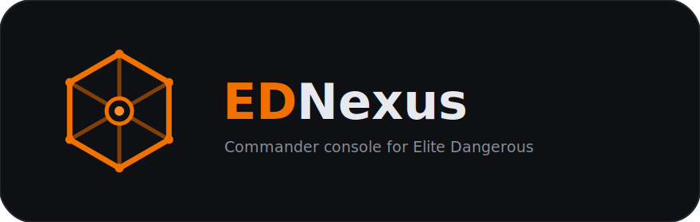

# EDNexus

<p align="center">
  
</p>

A single, does-it-all commander console for **Elite Dangerous** — built to replace the sprawl of
separate market, route, exobiology, colonisation, and materials tools with one cross-platform app.

It works off the game's own data: a watcher tails the journal (`Journal.*.log`) and the sidecar
status files (`Status.json`, `Cargo.json`, `Market.json`, …), turns them into a typed event stream,
and folds that into a single live commander state that every feature reads from.

## Stack

- **.NET 10** — cross-platform (Windows / Linux / macOS)
- **Avalonia 12** — the desktop UI
- **CommunityToolkit.Mvvm** — view models

## Projects

| Project | Role |
|---|---|
| `src/EDNexus.Core` | Engine: journal watcher → event bus → commander state |
| `src/EDNexus.App` | Avalonia dashboard |
| `src/EDNexus.Cli` | Headless harness (`--once` replays the latest journal and prints state) |

## Running

```sh
# Live dashboard
dotnet run --project src/EDNexus.App

# Headless: replay the latest journal and print current state
dotnet run --project src/EDNexus.Cli -- --once
```

The journal folder is auto-detected (Windows Saved Games, and the Steam/Proton prefix on Linux).
Override it with the `EDNEXUS_JOURNAL_DIR` environment variable.

## Privacy & crash reporting

EDNexus can send **anonymized** crash and error reports (via [Sentry](https://sentry.io)) so bugs
get found and fixed. It is **opt-in**: nothing is sent until you agree to the first-run prompt, and
you can change your mind any time in **Settings**.

**What is sent** (only with your consent):
- App version, operating system, and the error with its stack trace
- A random *install id* generated on your machine — not linked to your commander, account, or OS user

**What is never sent:**
- Your commander name, systems visited, or any journal contents
- Your OS/user name, or file paths that contain it (scrubbed before sending — see `PiiScrubber`)

The Sentry DSN is **not stored in this repository**. It is injected at release-build time from a CI
secret (`SENTRY_DSN`), so source builds have no DSN and reporting stays disabled. Developers can set
`EDNEXUS_SENTRY_DSN` locally to test.

## Installation

Installers are self-contained (no separate .NET install needed).

- **Windows** — run `EDNexus-<version>-setup.exe`. Installs to
  `C:\Program Files\Signal & Thread\EDNexus\` (path is changeable in the wizard). Built with
  [Inno Setup](https://jrsoftware.org/isinfo.php).
- **Linux** — `sudo apt install ./ednexus_<version>_amd64.deb`. Installs to
  `/opt/signal-and-thread/ednexus/` with an `ednexus` launcher on your `PATH`. Built with
  [FPM](https://github.com/jordansissel/fpm).

Preferences are stored in **`Documents\EDNexus`** (Windows) / **`~/EDNexus`** (Linux) — never in the
install directory, so the app folder can stay read-only.

### Building the installers locally

```powershell
# Windows (needs Inno Setup 6: choco install innosetup)
installer\windows\build.ps1 -Version 0.1.0
```
```sh
# Linux (needs fpm: gem install fpm)
installer/linux/build-deb.sh 0.1.0
```

## Releases

Tagging a release (`git tag v0.1.0 && git push --tags`) triggers `.github/workflows/release.yml`,
which builds the Windows installer and Linux `.deb` — injecting the DSN from the `SENTRY_DSN` secret
(and uploading debug symbols when `SENTRY_AUTH_TOKEN` is set) — and attaches them to a GitHub Release.
See the workflow header for the required Actions secrets.

## Roadmap

- [x] Journal engine (watcher, event bus, commander state)
- [x] Avalonia dashboard shell
- [ ] Colonisation tracker (construction depots, shopping lists, hauling progress)
- [ ] Market / trade search + route plotting (Spansh, EDSM)
- [ ] Materials & exobiology tracking
- [ ] In-game overlay + voice callouts
