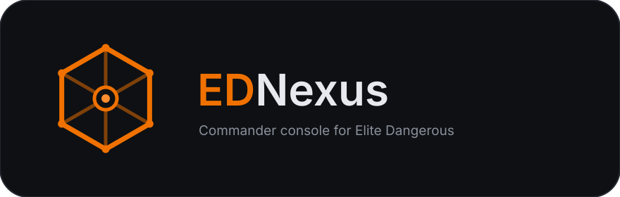

# EDNexus — Commander Console for Elite Dangerous

<p align="center">
  
</p>

<p align="center">
  <a href="https://github.com/Signal-Thread-LLC/EDNexus/actions/workflows/ci.yml"></a>
  <a href="https://github.com/Signal-Thread-LLC/EDNexus/releases/latest"></a>
  <a href="https://signal-thread-llc.github.io/EDNexus/"></a>
</p>

A single, does-it-all **[Elite Dangerous](https://www.elitedangerous.com/) commander console** — a
free, open-source tool that replaces the sprawl of separate market, trade route, engineering,
exobiology, colonisation, and materials tools with one cross-platform desktop app for Windows,
Linux, and macOS (including Steam Deck).

**[📖 Homepage & downloads](https://signal-thread-llc.github.io/EDNexus/)** ·
**[⬇ Latest release](https://github.com/Signal-Thread-LLC/EDNexus/releases/latest)** ·
**[🐛 Report an issue](https://github.com/Signal-Thread-LLC/EDNexus/issues)**

It works off the game's own data: a watcher tails the journal (`Journal.*.log`) and the sidecar
status files (`Status.json`, `Cargo.json`, `Market.json`, …), turns them into a typed event stream,
and folds that into a single live commander state that every feature reads from.

## Features

- **Colonisation tracker** — construction depot progress, commodity shopping lists, and hauling
  progress for system colonisation.
- **Market & trade route search** — commodity market lookups and profitable trade route plotting,
  powered by [Spansh](https://spansh.co.uk/) and [EDSM](https://www.edsm.net/).
- **Engineering** — blueprint pinning, material shopping lists across every engineering grade and
  roll count, and Odyssey on-foot suit/weapon upgrades.
- **Materials & exobiology** — raw/manufactured/encoded material tracking and exobiology genus/species
  scan data as you play.
- **EDDN & Inara integration** — opt-in, anonymized contributions to the
  [Elite Dangerous Data Network](https://github.com/EDCD/EDDN), and opt-in sync of your commander
  profile to [Inara](https://inara.cz).
- **Live journal parsing** — a watcher tails the game's own `Journal.*.log` and status sidecar files
  (no third-party account or API key required to get started).

## Stack

- **.NET 10** — cross-platform (Windows / Linux / macOS)
- **Avalonia 12** — the desktop UI
- **CommunityToolkit.Mvvm** — view models

## Projects

| Project | Role |
|---|---|
| `src/EDNexus.Core` | Engine: journal watcher → event bus → commander state, plus the reporting bridge |
| `src/EDNexus.App` | Avalonia dashboard |
| `src/EDNexus.Cli` | Headless harness (`--once` replays the latest journal and prints state) |
| `src/EliteDangerous.Eddn` | Standalone, reusable EDDN upload client (no EDNexus dependency) |
| `src/EliteDangerous.Inara` | Standalone, reusable Inara API client (no EDNexus dependency) |

## Running

```sh
# Live dashboard
dotnet run --project src/EDNexus.App

# Headless: replay the latest journal and print current state
dotnet run --project src/EDNexus.Cli -- --once

# What do I still need for grade 5 Increased FSD Range, over 3 rolls?
# (omit the blueprint id to list every blueprint that can be planned)
dotnet run --project src/EDNexus.Cli -- --once --plan fsd_increased_range 5 3
```

The journal folder is auto-detected (Windows Saved Games, and the Steam/Proton prefix on Linux).
Override it with the `EDNEXUS_JOURNAL_DIR` environment variable.

## Privacy & crash reporting

EDNexus can send **anonymized** crash and error reports (via [Sentry](https://sentry.io)) so bugs
get found and fixed. It is **opt-in**: nothing is sent until you agree to the first-run prompt, and
you can change your mind any time in **Settings**.

**What is sent** (only with your consent):
- App version, operating system, and the error with its stack trace
- A random *install id* generated on your machine — not linked to your commander, account, or OS user

**What is never sent:**
- Your commander name, systems visited, or any journal contents
- Your OS/user name, or file paths that contain it (scrubbed before sending — see `PiiScrubber`)

The Sentry DSN is **not stored in this repository**. It is injected at release-build time from a CI
secret (`SENTRY_DSN`), so source builds have no DSN and reporting stays disabled. Developers can set
`EDNEXUS_SENTRY_DSN` locally to test.

## Data reporting (EDDN & Inara)

EDNexus can feed the two community services every commander tool is expected to. Both are **opt-in,
default off**, and are toggled in **Settings**:

- **EDDN** — contributes **anonymized** market, scan, and travel data to the
  [Elite Dangerous Data Network](https://github.com/EDCD/EDDN). The relay obfuscates the uploader id,
  and messages carry only game-world data (no personal identity). Uploads happen live as you play.
- **Inara** — syncs **your** commander (identity, credits, ranks, and travel) to your
  [Inara](https://inara.cz) profile using your personal Inara API key. To respect Inara's rate
  guidance, it only sends on session start, docking, FSD jumps, and session end — never continuously.

Neither reporter sends anything until you enable it. Replaying an old journal (e.g. the CLI `--once`
harness) never transmits — only live events are reported.

The two clients live in **standalone libraries** (`EliteDangerous.Eddn`, `EliteDangerous.Inara`) with
no dependency on the EDNexus engine, so they can be reused by other tools or split out later. EDNexus
drives them through a small bridge in `EDNexus.Core/Reporting`.

> Filling gaps the journal misses via the **Frontier CAPI** is planned but not yet implemented — it
> needs an approved Frontier developer client id. The reporting layer leaves a clean seam for it.

## Installation

Installers are self-contained (no separate .NET install needed).

- **Windows** — run `EDNexus-<version>-setup.exe`. Installs to
  `C:\Program Files\Signal & Thread\EDNexus\` (path is changeable in the wizard). Built with
  [Inno Setup](https://jrsoftware.org/isinfo.php).
- **Linux (incl. SteamOS / Steam Deck)** — distributed as a [Flatpak](packaging/flatpak/README.md).
  The immutable Steam Deck filesystem rules out native package installs, and Flatpak also covers
  Debian/Ubuntu/Fedora/Arch from a single build. See [`packaging/flatpak/`](packaging/flatpak/).

Preferences are stored in **`%LOCALAPPDATA%\EDNexus`** (Windows) / **`~/.local/share/EDNexus`**
(Linux), alongside the logs — never in the install directory, so the app folder can stay read-only.
They deliberately do **not** live in Documents: that folder is commonly cloud-synced (OneDrive
Known Folder Move), which would copy the settings — including your Inara API key — off-machine, and
invite sync conflicts on a file that is rewritten every time you tweak the dashboard. An older
install's settings are migrated out of `Documents\EDNexus` automatically on first run.

To carry your **dashboard arrangement** between machines, use **Settings → Dashboard → Export…**
and **Import…**. That file contains only the card layout — never your API key — so it is safe to
sync, share or keep in version control.

### Building the installers locally

```powershell
# Windows (needs Inno Setup 6: choco install innosetup)
installer\windows\build.ps1 -Version 0.1.0
```
```sh
# Linux (self-contained payload the Flatpak consumes; prints the tarball + sha256)
packaging/flatpak/build-flatpak.sh 0.1.0
```

## Releases

Tagging a release (`git tag v0.1.0 && git push --tags`) triggers `.github/workflows/release.yml`,
which builds the Windows installer and the Linux self-contained tarball (the payload the Flatpak
consumes) — injecting the DSN from the `SENTRY_DSN` secret (and uploading debug symbols when
`SENTRY_AUTH_TOKEN` is set) — and attaches them to a GitHub Release. See the workflow header for
the required Actions secrets.

## Roadmap

- [x] Journal engine (watcher, event bus, commander state)
- [x] Avalonia dashboard shell
- [x] Colonisation tracker (construction depots, shopping lists, hauling progress)
- [x] Market / trade search + route plotting (Spansh, EDSM)
- [x] Engineering (blueprint pinning, material guidance, Odyssey on-foot upgrades)
- [x] Materials & exobiology tracking
- [ ] Missions, community goals & Galnet news
- [ ] Progression & rank trackers
- [ ] In-game overlay + voice callouts
